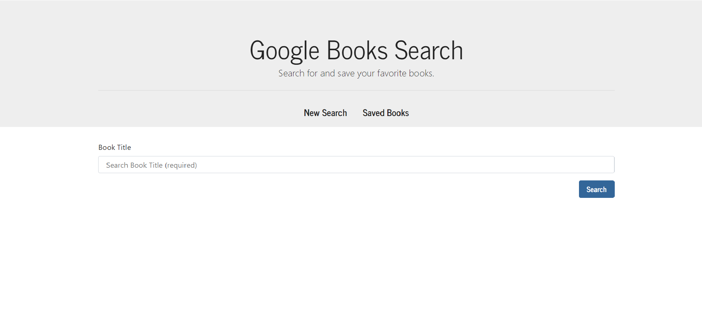
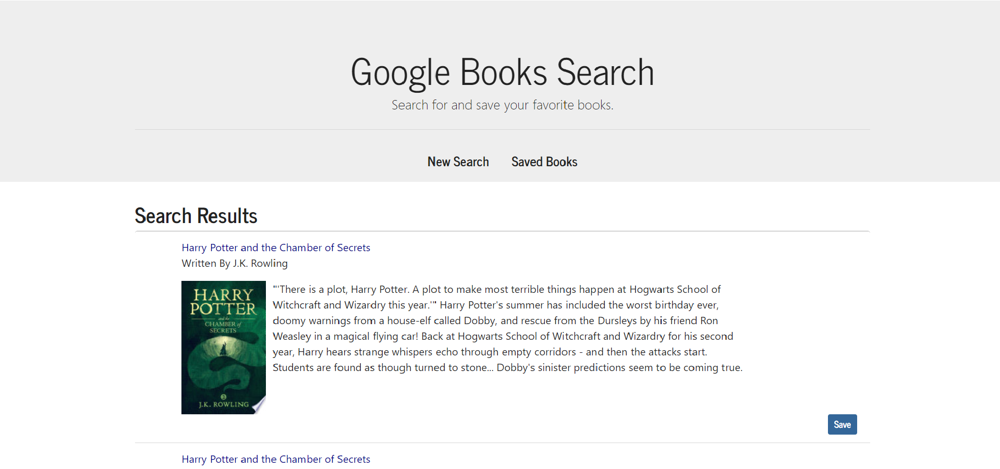
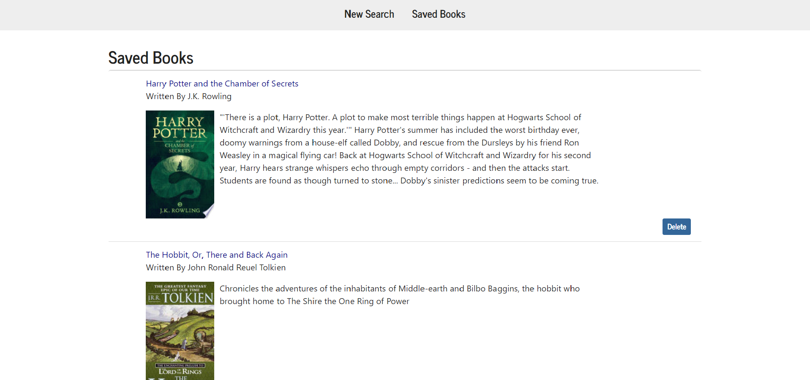
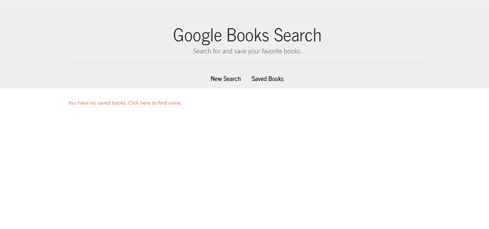

# GoogleBooksSearch
This react-based app uses google books API to search for books and mongodb to save them.
Type in the name of a book to search.

View the books found in google books and save the ones you like!

You can view saved books and delete them.

Deleting all your saved books creates a link back to the search bar.

